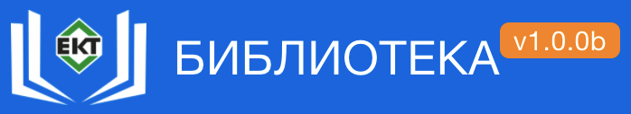
## Project goal:
- Streamline work with the corporate library by consolidating information about books and readers

## Roles:
* User
* Admin

## Key features:

### User
* Can view a list of books stored in the library
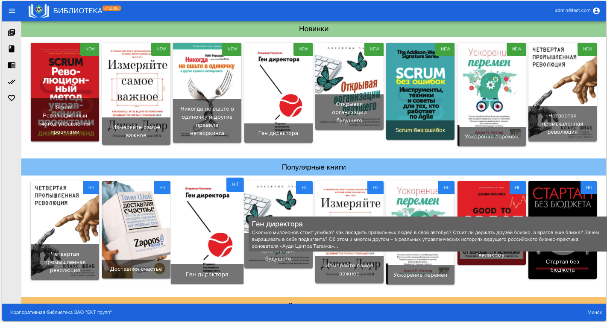
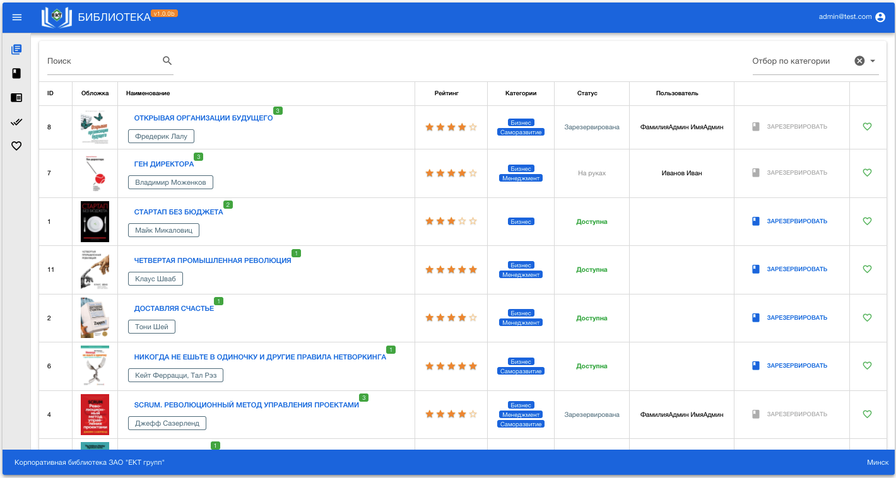
* For each of the books he can see:
  - title, description, cover
  - status (available, reserved, on hand)
  - raring
  - comments
  - categories
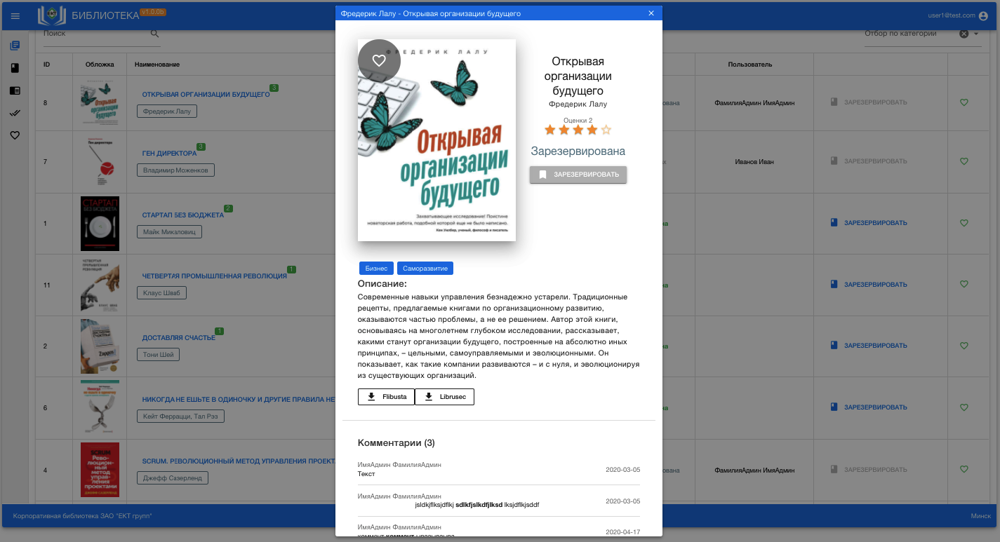
* Can vote
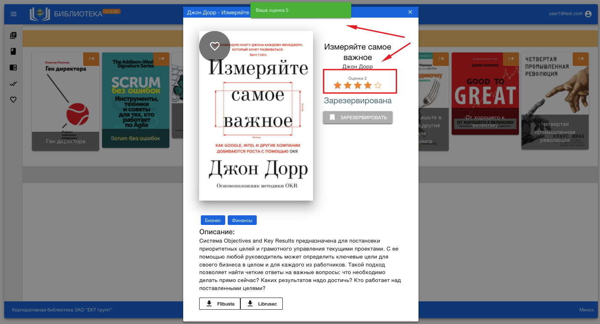
* Can add a comments
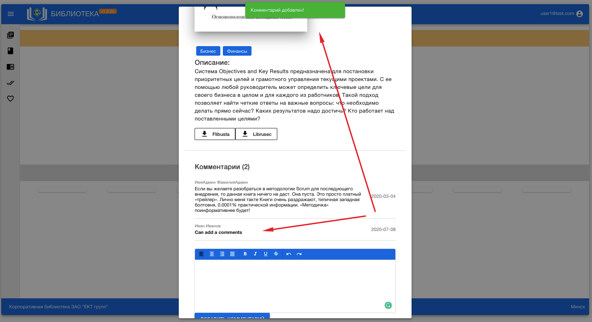
* Can search for a book by author, title, categories
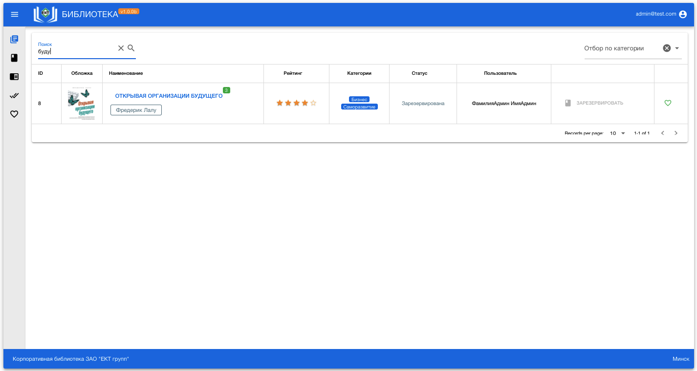
* Can filter books by categories
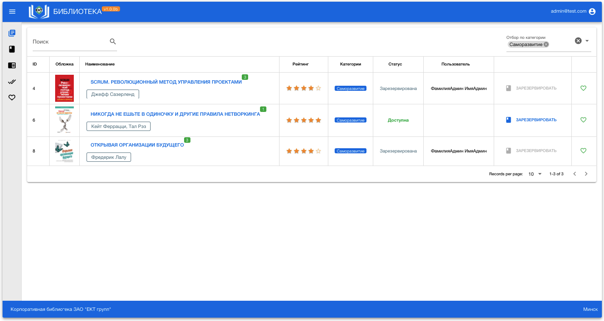
* Can booking a book
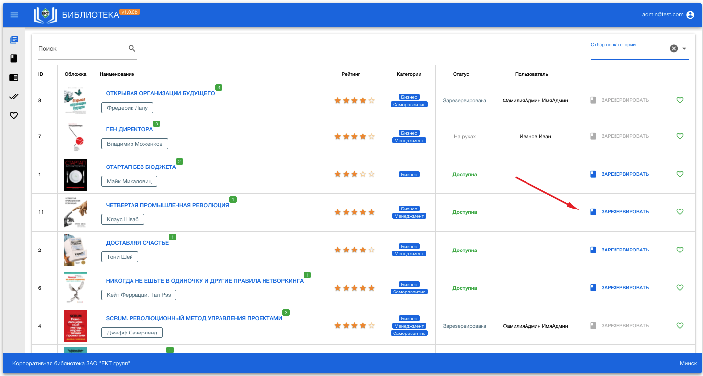
* Can add a book to the “wish list”
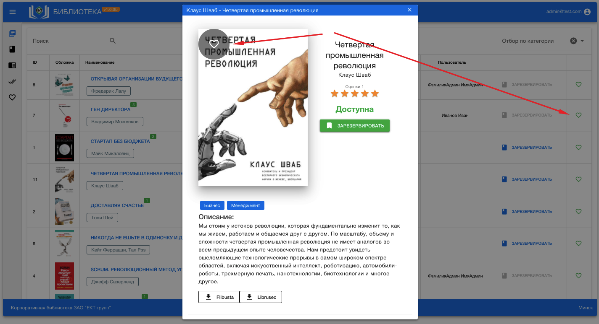
* Can generate reports:
    - my booking list
    - “debts” to the library 
	- my readed books
	- my “wish list”

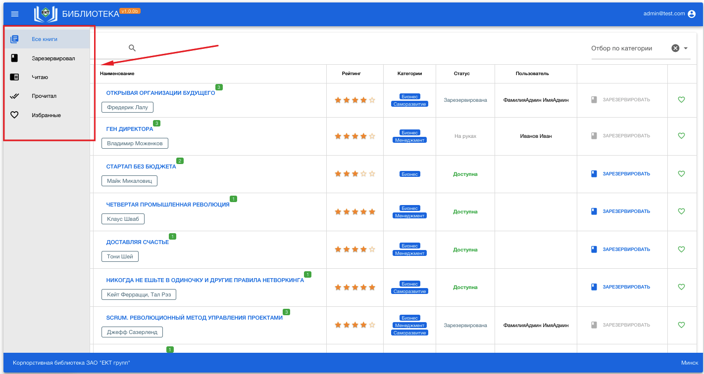
* Can downloads e-books from other services
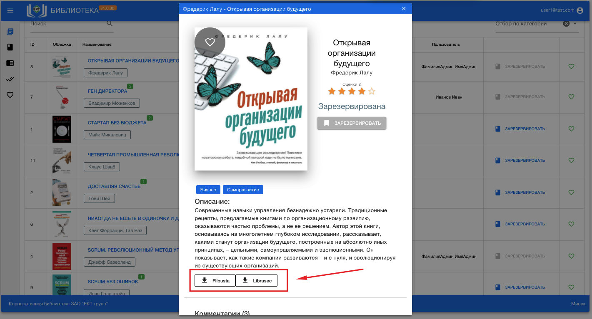

### Admin
#### Books
* Can create new books
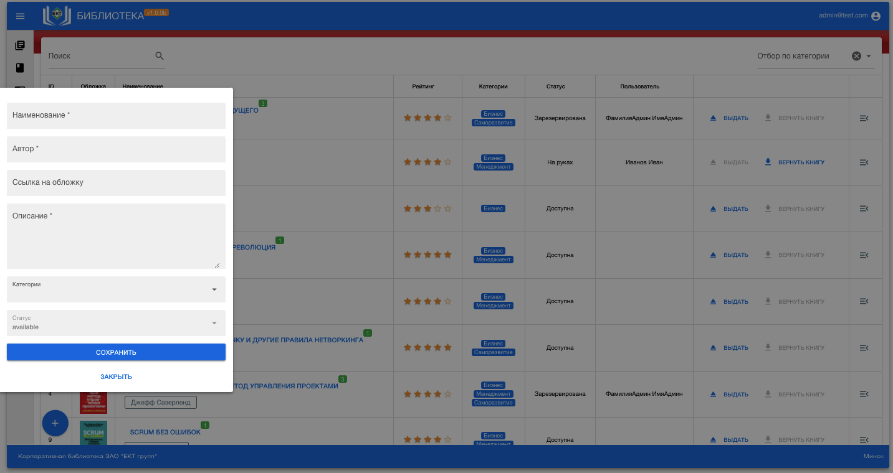
* Can edit books
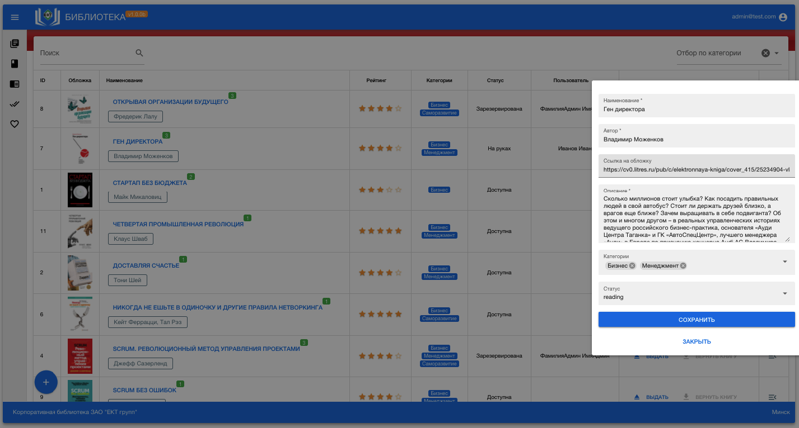
* Can delete books
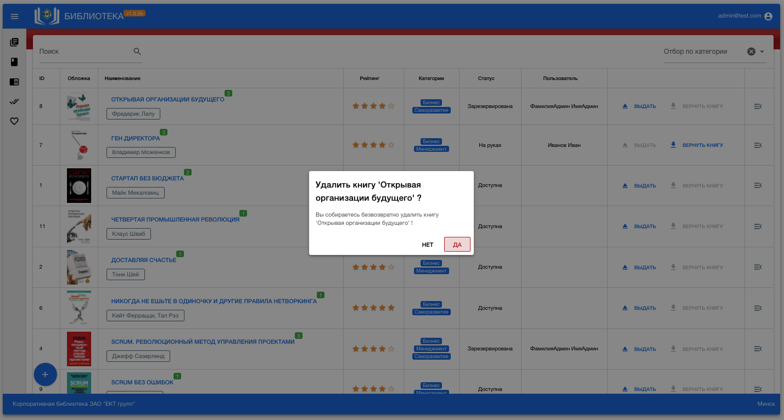
* Can give a book
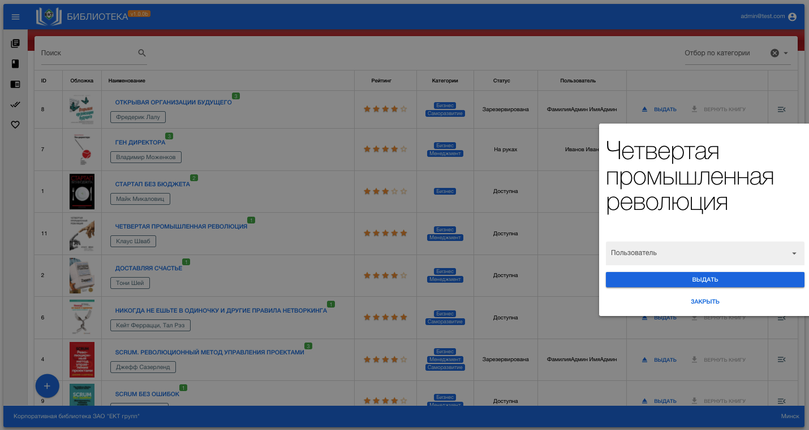
* Can return a book
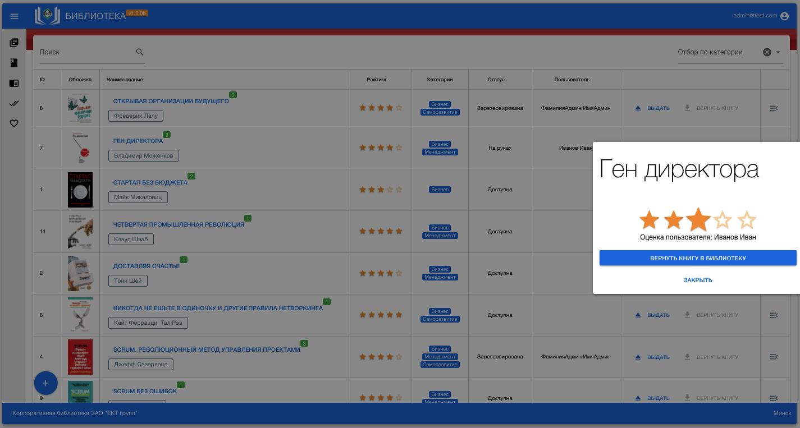
* Can see action log
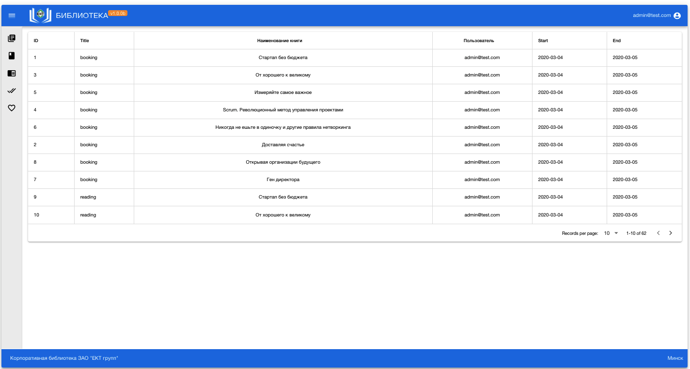
#### Users
* Can create, update, delete users
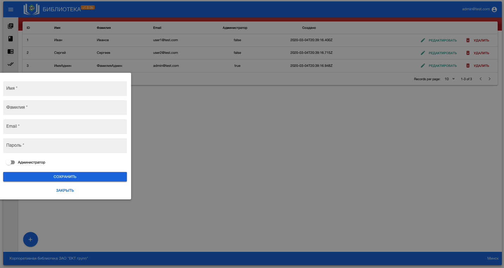
#### Categories
* Can create, update, delete categories
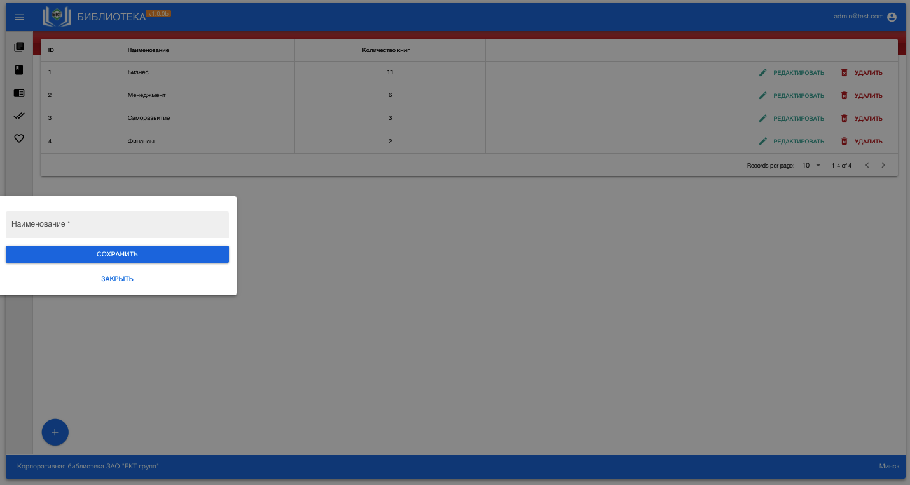
